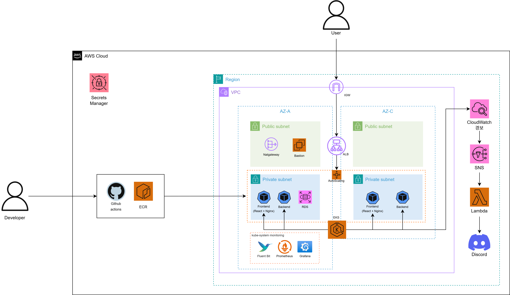
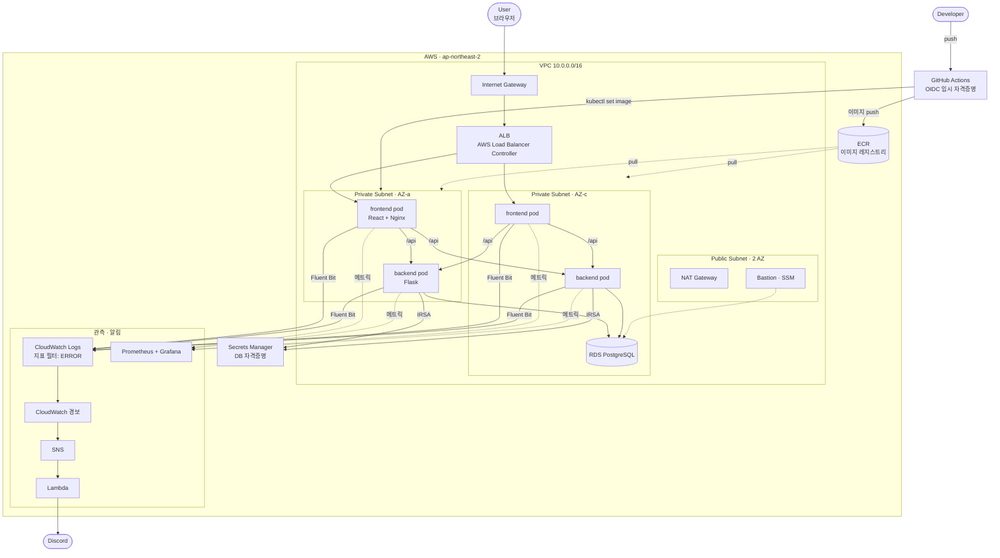

# TaskFlow — Infra

**AWS EKS 위에 컨테이너 서비스를 배포·관측·운영하는 인프라를 Terraform으로 구성한 레포**입니다.
애플리케이션(할 일 관리)은 단순하게 두고, **배포 자동화 · 장애 감지 · 다중 AZ 가용성**을 갖추는 데 집중했습니다.

> 이 레포는 인프라 산출물(Terraform 코드, 쿠버네티스 매니페스트)을 담습니다.
> 애플리케이션 코드는 [frontend](https://github.com/taskflow-eks/taskflow-frontend) · [backend](https://github.com/taskflow-eks/taskflow-backend) 를 참고하세요.

---

## 아키텍처



<details>
<summary>텍스트(mermaid) 버전 펼치기</summary>



</details>

**한눈에 보는 흐름**

1. **배포** — `main` 푸시 → GitHub Actions가 OIDC로 임시 자격증명 발급 → 이미지 빌드 후 ECR push → `kubectl set image` → **파드가 Ready가 될 때까지 확인**하고 종료
2. **트래픽** — ALB가 두 AZ의 프론트엔드 파드로 분산 → Nginx가 `/api`를 백엔드 서비스로 프록시 → 백엔드가 RDS 조회
3. **관측** — Fluent Bit이 컨테이너 로그를 CloudWatch로 중앙화, 로그에서 `ERROR` 감지 시 경보 → SNS → Lambda → **Discord 알림**

---

## 기술 스택

| 영역 | 사용 기술 |
|---|---|
| 오케스트레이션 | Amazon EKS v1.30 (관리형 노드 그룹, t3.medium × 2) |
| IaC | Terraform (`terraform-aws-modules` vpc / eks / iam) |
| 네트워크 | VPC, 퍼블릭·프라이빗 서브넷 (2 AZ), NAT Gateway, IGW |
| 외부 노출 | ALB (AWS Load Balancer Controller, Ingress) |
| 데이터베이스 | RDS PostgreSQL 16 (프라이빗 서브넷) |
| 이미지 | ECR (스캔 활성화, 최근 10개 유지) |
| 로그 | Fluent Bit → CloudWatch Logs |
| 지표 | kube-prometheus-stack (Prometheus + Grafana) |
| 알림 | CloudWatch 경보 → SNS → Lambda → Discord |
| 자격증명 | IRSA, GitHub Actions OIDC, Secrets Manager |
| CI/CD | GitHub Actions (레포별 분리) |

---

## 핵심 설계 포인트

- **다중 AZ 이중화** — 워커 노드를 서로 다른 두 가용영역에 두고, 프론트·백엔드를 각각 2 replica로 배치했습니다. `topologySpreadConstraints`로 같은 AZ에 몰리지 않게 해, 한쪽 AZ에 문제가 생겨도 남은 파드가 요청을 처리합니다.

- **배포 완료의 기준을 "파드 기동"으로** — `kubectl apply`나 `set image`는 요청 접수까지만 확인하고 끝나기 때문에, 파드가 `CrashLoopBackOff`에 빠져도 워크플로우는 성공으로 표시됩니다. `kubectl rollout status`를 붙여 **실제로 Ready가 된 뒤에** 배포를 성공으로 처리하고, 실패하면 파드 상태와 로그를 자동 출력합니다.

- **파드에 액세스 키를 두지 않음** — 백엔드는 IRSA로 연결된 IAM 역할로 Secrets Manager에서 DB 자격증명을 읽습니다. GitHub Actions도 장기 액세스 키 대신 **OIDC로 실행 시점에 임시 자격증명**을 발급받고, 신뢰 정책에서 세 레포의 `main` 브랜치만 허용합니다.

- **감지 이후를 자동화** — 지표를 대시보드로 보는 것만으로는 사람이 보고 있을 때만 알 수 있습니다. 로그 지표 필터로 `ERROR`를 세고, 임계치를 넘으면 **사람이 확인하기 전에 Discord로 먼저 도착**하도록 구성했습니다.

- **네트워크 격리** — 애플리케이션과 데이터베이스는 프라이빗 서브넷에만 둡니다. 인바운드는 ALB만 받고, 운영자 접근은 Bastion(SSM Session Manager)을 경유합니다. RDS 보안 그룹은 워커 노드와 Bastion의 보안 그룹에서 오는 5432만 허용합니다.

---

## 저장소 구조

```
.
├── terraform/          # AWS 인프라
│   ├── vpc.tf          #   VPC, 서브넷, NAT
│   ├── eks.tf          #   클러스터, 노드 그룹, 네임스페이스, ServiceAccount
│   ├── ecr.tf          #   이미지 레포 + 라이프사이클
│   ├── rds.tf          #   PostgreSQL + Secrets Manager
│   ├── bastion.tf      #   Bastion EC2
│   ├── irsa.tf         #   IRSA 역할 (backend / ALB Controller / Fluent Bit)
│   ├── addons.tf       #   Helm: ALB Controller, Fluent Bit, Prometheus·Grafana
│   ├── monitoring.tf   #   지표 필터 → 경보 → SNS → Lambda → Discord
│   ├── github-oidc.tf  #   GitHub Actions OIDC 역할 및 EKS 접근 권한
│   └── lambda/         #   Discord 알림 함수
├── k8s/                # 쿠버네티스 매니페스트
└── .github/workflows/  # Terraform 검사 + 매니페스트 적용
```

---

## 사용법

Terraform 실행 방법은 [terraform/README.md](./terraform/README.md)를 참고하세요.

- `k8s/` 가 변경되면 GitHub Actions가 매니페스트를 적용하고 rollout을 확인합니다.
- `terraform/` 에 PR을 올리면 `fmt` · `validate` 검사가 실행됩니다.

---

## 한계 & 개선 방향

현재 구성의 한계를 인지하고 있으며, 실제 운영 환경이라면 다음을 개선하겠습니다.

| 한계 | 개선 방향 |
|---|---|
| **NAT Gateway 1개** — 해당 AZ 장애 시 프라이빗 서브넷 아웃바운드 전체 중단 | AZ별 NAT Gateway 배치 (비용과 트레이드오프) |
| **RDS 단일 AZ** — DB 장애 시 서비스 중단 | Multi-AZ 배포 + 읽기 전용 복제본 |
| **오토스케일링 없음** — 노드 수가 고정이라 트래픽 급증에 대응 불가 | HPA + Cluster Autoscaler (또는 Karpenter) |
| **Terraform 상태가 로컬** — 협업 시 상태 충돌, 유실 위험 | S3 백엔드 + DynamoDB 상태 잠금 |
| **`kubectl set image` 방식 배포** — 클러스터 실제 상태가 Git에 남지 않음 | ArgoCD 기반 GitOps로 전환 |
| **네임스페이스만 격리, NetworkPolicy 없음** | 파드 간 통신을 명시적으로 허용하는 정책 적용 |
| **GitHub Actions 역할이 클러스터 관리자 권한** | 네임스페이스 범위로 축소한 EKS Access Entry |
| **HTTPS 미적용** — ALB가 HTTP만 수신 | ACM 인증서 + Route53 도메인 연결 |

---

## 관련 레포지토리

- [taskflow-frontend](https://github.com/taskflow-eks/taskflow-frontend) — React + Vite + Nginx
- [taskflow-backend](https://github.com/taskflow-eks/taskflow-backend) — Flask API
